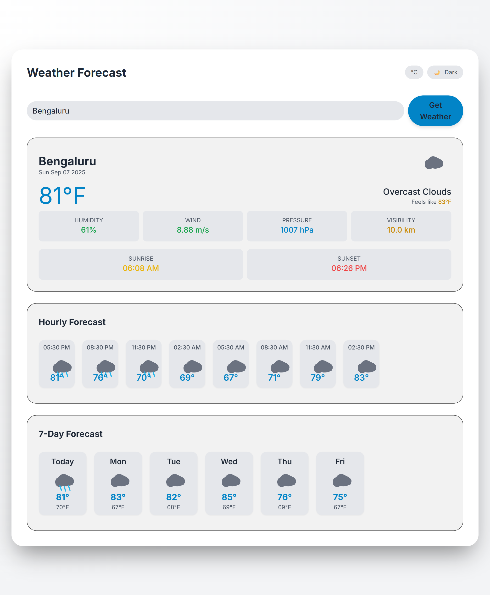
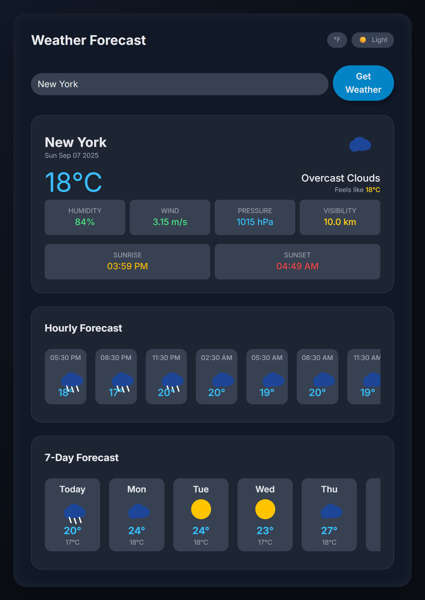
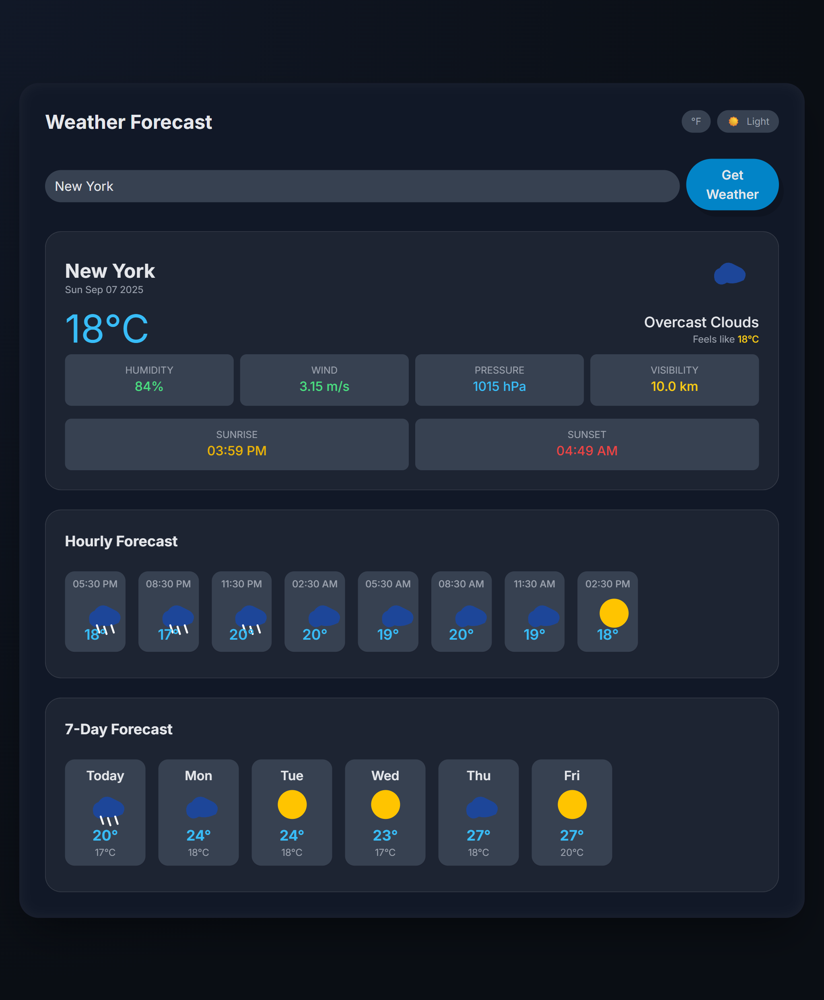
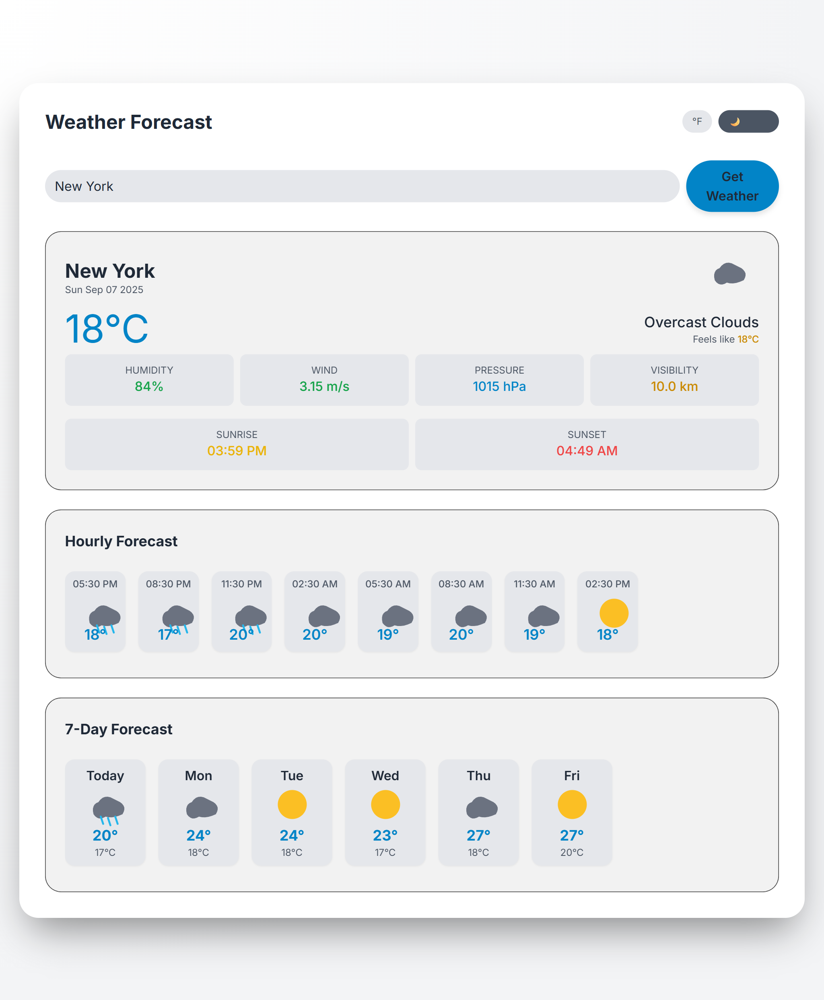
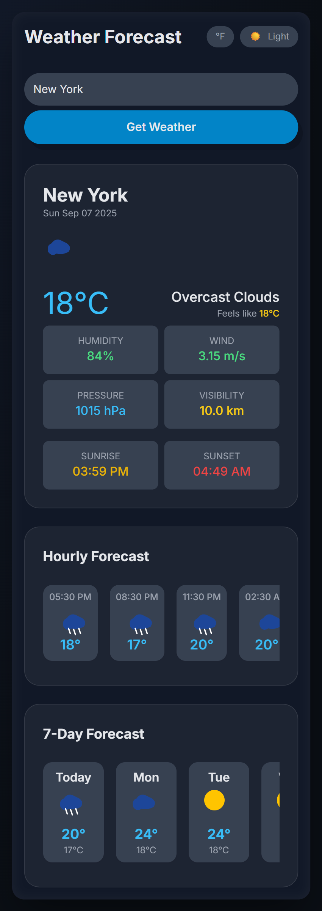
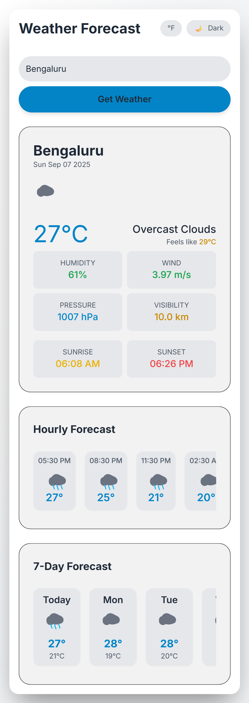

#  Weather Forecast Web Application

A modern, responsive **Weather Forecast Web App** built with **HTML, CSS, JavaScript,** and **Tailwind CSS**, powered by the **OpenWeather API**. It provides real-time weather data, hourly forecasts, 7-day outlooks, and more—all in an elegant interface.

---

##  Live Demo

Check out the app in action: **[https://projectmahe.github.io/weather-app/](https://projectmahe.github.io/weather-app/)**

---

##  Video Demo

Watch the full project walkthrough and UI demo here:

[](https://youtu.be/VLtlD7inPiU)

---

##  Features

-  **Search by City** — Fetch weather for any city globally  
-  **Current Weather Details** — Temperature, description, feels-like, humidity, wind, pressure, visibility  
-  **Hourly Forecast** — Forecast for the next 24 hours  
-  **7-Day Forecast** — Extended outlook with daily highs/lows  
-  **Sunrise & Sunset Times**  
-  **Dark/Light Mode** — Toggle theme with smooth transitions  
-  **Responsive Design** — Optimized for mobile and desktop  
-  **Animated Weather Icons** — Dynamic SVG-based icons that change with conditions  
-  **Error Handling & Loading States** — Graceful feedback with modals and spinners

---

##  Tech Stack

- **Frontend:** HTML5, CSS3, JavaScript (ES6+), Tailwind CSS  
- **API:** [OpenWeatherMap API](https://openweathermap.org/api)  
- **Hosting:** GitHub Pages

---

##  Getting Started

### Prerequisites

- A modern browser (e.g. Chrome, Firefox, Edge)
- Your own [OpenWeatherMap API key](https://home.openweathermap.org/users/sign_up)

### Setup Instructions

1. **Clone the repo:**
   ```bash
   git clone https://github.com/projectmahe/weather-app.git
   cd weather-app

2. **Add your API key:**
Edit the JavaScript file (e.g., script.js) and replace:
with your own API key:

const API_KEY = "YOUR_OPENWEATHER_API_KEY";


3. **Run locally:**
Simply open index.html in your browser—it’s a static site requiring no server

## 📸 Project Preview

The Weather Forecast Web App is fully **responsive**, working seamlessly across devices.  

### 🌐 Desktop View


### 💻 Tablet View


### 📱 Mobile View


## 🎨 Dark & Light Theme Support

This app comes with **built-in theme switching**.  
Users can easily toggle between **Dark Mode** 🌙 and **Light Mode** ☀️ for a better viewing experience.  

### 🌙 Dark Mode


### ☀️ Light Mode


### 📱 Mobile Dark Mode


### 📱 Mobile Light Mode



⭐ If you enjoyed this project or found it helpful, leave a ⭐ on the repo and share your feedback!
